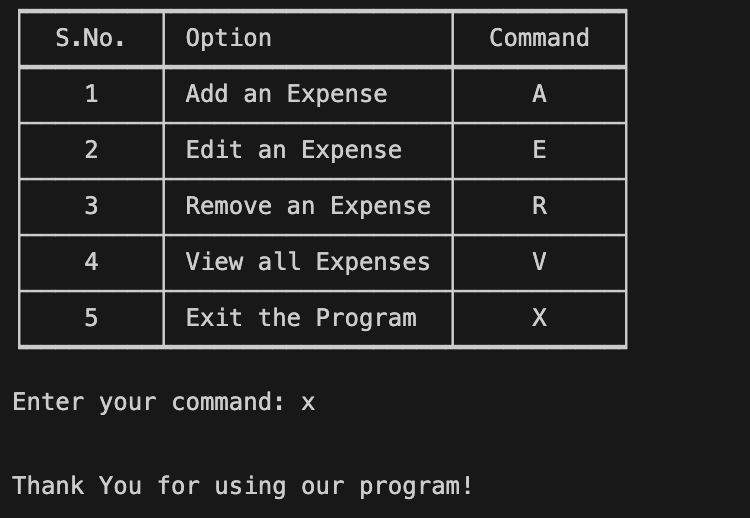

# CS50P Final Project: Expenditure Management Program
#### Video Demo:  <https://youtu.be/XNWo1UCty7E>
#### Description:

## Introduction
Expenditure Mangament Program is program that allows you to add, edit, remove and view entries of expenses that you might have incurred or would like to record. Initially, I hadn't a clue about what I should make for my final project; so I asked others for suggestions. When I heard about this idea, I thought that this is something that I would like to use myself! Thus, I ended up making this program with my own self as a prospective user.

## Features
The program comprises 4 major features that are powered by 6 different functions (apart from the main function) that help run it. In no particular order, these features are as follows.

### **Add an Expense**
**Add an Expense** allows the user to add an expense entry that is recorded as a list in a list of lists. The entry comprises 2 parts: Expense Name, and Expense Amount.

Although the name can be anything, the amount is restricted to being a positive integer.

### **Edit an Expense**
This feature allows us to edit the expenses that we have recorded. It works by promting the user to enter the ID of the expense that they would like to edit and then allowing the user to edit both; Expense Name and Expense Amount as desired.

In the event that a user does not have any entries to edit, the function displays "No entries to edit."

### **Remove an Expense**
**Removing an Expense** allows for a recorded expense to be removed based on the ID that the user enters. For this function, I have made it a point to not alter the IDs of other expenses to prevent the IDs from changing. So for example, the user's removal of the expense at ID # 1 prevents the following IDs to be reduced by 1. As a result, ID # 2 and onwards would remain with the same IDs.

In the event that a user does not have any entries to remove, the function displays "No entries to remove."

### **View all Expense**
All the recorded expenses in our program can be viewed by entering "V" at the main menu, which returns a table of all the recorded expenses. The table is returned with the help of the "Tabulate" library.

In the event that the user does not have any entries to display, this function simply returns "No entries to view."

### **Exit the Program**
The final feature of the program exits the forever loop that constantly displays the main menu and terminates the program as well. By simply entering the "X" key, the program can be exited.

